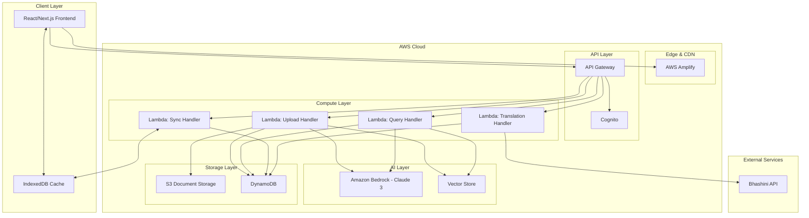

# Design Document: KiroFeed System

## Overview

KiroFeed is a serverless, multilingual document assistant platform built on AWS infrastructure. The system enables users to upload PDF documents and interact with them through an AI-powered chat interface that supports multiple Indian regional languages. The architecture follows a three-tier pattern: a React-based frontend deployed on AWS Amplify, a Python FastAPI backend running on AWS Lambda, and a data layer using DynamoDB for persistence and S3 for document storage.

The core innovation lies in combining RAG (Retrieval-Augmented Generation) with strict hallucination prevention, multilingual support via Bhashini API, and offline-first capabilities with intelligent synchronization. The system uses Amazon Bedrock's Claude 3 model for natural language understanding while ensuring responses are grounded strictly in uploaded document content.

## Architecture

### High-Level Architecture



### Component Interaction Flow

**Document Upload Flow:**
1. User uploads PDF through React UI
2. Frontend sends file to API Gateway with JWT token
3. API Gateway validates token with Cognito
4. Upload Handler Lambda receives file
5. Lambda stores PDF in S3 with user-scoped key
6. Lambda extracts text using PyPDF2/pdfplumber
7. Lambda chunks text using langchain
8. Lambda generates embeddings via Bedrock
9. Lambda stores embeddings in Vector Store
10. Lambda records metadata in DynamoDB
11. Response returns to frontend with document ID

**Query Processing Flow:**
1. User submits query in selected language
2. Frontend checks if translation needed
3. If non-English, Translation Handler calls Bhashini API
4. Query Handler receives translated query
5. Lambda performs semantic search in Vector Store
6. Lambda retrieves top-k relevant chunks
7. Lambda constructs RAG prompt with strict instructions
8. Lambda calls Bedrock Claude 3 with prompt
9. Lambda validates response contains citations
10. If response needed in regional language, Translation Handler translates
11. Response with citations returns to frontend

**Offline Sync Flow:**
1. User performs actions while offline
2. Frontend stores operations in IndexedDB with sync-pending flag
3. Sync Manager detects connection restoration
4. Sync Handler Lambda receives batch of pending operations
5. Lambda validates and processes each operation
6. Lambda updates DynamoDB
7. Lambda returns sync confirmation
8. Frontend removes sync-pending flags

## Components and Interfaces

### Frontend Components

#### 1. Authentication Module
- **LoginPage**: Handles user login with Cognito
- **SignupPage**: Handles user registration
- **AuthContext**: React context managing authentication state and JWT tokens
- **ProtectedRoute**: HOC for route protection

**Interfaces:**
```typescript
interface AuthContextValue {
  user: User | null;
  token: string | null;
  login: (email: string, password: string) => Promise<void>;
  signup: (email: string, password: string, name: string) => Promise<void>;
  logout: () => void;
  isAuthenticated: boolean;
}

interface User {
  id: string;
  email: string;
  name: string;
}
```

#### 2. Language Management Module
- **LanguageContext**: React context for language state
- **LanguageSwitcher**: UI component for language selection
- **TranslationService**: Service for Bhashini API integration

**Interfaces:**
```typescript
interface LanguageContextValue {
  currentLanguage: string;
  supportedLanguages: Language[];
  setLanguage: (languageCode: string) => void;
  translate: (text: string, targetLang: string) => Promise<string>;
}

interface Language {
  code: string;
  name: string;
  nativeName: string;
}
```

#### 3. Document Management Module
- **DocumentUploader**: Component for PDF upload with progress
- **DocumentList**: Displays user's uploaded documents
- **DocumentViewer**: PDF viewer with citation highlighting

**Interfaces:**
```typescript
interface Document {
  id: string;
  userId: string;
  filename: string;
  s3Key: string;
  uploadedAt: string;
  fileSize: number;
  pageCount: number;
  processingStatus: 'pending' | 'processing' | 'completed' | 'failed';
}

interface UploadProgress {
  documentId: string;
  progress: number;
  status: string;
}
```

#### 4. Chat Interface Module
- **ChatWindow**: Main chat interface component
- **MessageList**: Displays conversation history
- **MessageInput**: Input field with send button
- **CitationMarker**: Clickable citation component
- **LoadingSkeleton**: Loading state indicator

**Interfaces:**
```typescript
interface Message {
  id: string;
  sessionId: string;
  role: 'user' | 'assistant';
  content: string;
  citations?: Citation[];
  timestamp: string;
  language: string;
}

interface Citation {
  documentId: string;
  pageNumber: number;
  chunkId: string;
  text: string;
}

interface ChatSession {
  id: string;
  userId: string;
  documentId: string;
  createdAt: string;
  lastMessageAt: string;
}
```

#### 5. Offline Storage Module
- **IndexedDBManager**: Wrapper for IndexedDB operations
- **SyncManager**: Handles offline-to-online synchronization
- **SyncStatus**: UI component showing sync state

**Interfaces:**
```typescript
interface SyncOperation {
  id: string;
  type: 'message' | 'document' | 'session';
  operation: 'create' | 'update' | 'delete';
  data: any;
  timestamp: string;
  syncStatus: 'pending' | 'syncing' | 'completed' | 'failed';
  retryCount: number;
}

interface SyncResult {
  operationId: string;
  success: boolean;
  error?: string;
}
```

### Backend Components

#### 1. API Gateway Configuration
- **Endpoints**: RESTful API endpoints
- **Authorizer**: Cognito JWT validation
- **CORS**: Cross-origin resource sharing configuration

**API Endpoints:**
```
POST   /auth/signup
POST   /auth/login
POST   /documents/upload
GET    /documents
GET    /documents/{documentId}
DELETE /documents/{documentId}
POST   /chat/query
GET    /chat/sessions
GET    /chat/sessions/{sessionId}/messages
POST   /sync/push
POST   /translate
```

#### 2. Lambda Functions

**Upload Handler Lambda:**
- Receives multipart file upload
- Stores PDF in S3
- Extracts text from PDF
- Chunks text into segments
- Generates embeddings
- Stores in vector database
- Records metadata in DynamoDB

**Interfaces:**
```python
class UploadRequest:
    file: bytes
    filename: str
    user_id: str
    
class UploadResponse:
    document_id: str
    status: str
    message: str
```

**Query Handler Lambda:**
- Receives user query
- Performs vector similarity search
- Retrieves relevant chunks
- Constructs RAG prompt
- Calls Bedrock API
- Validates response
- Returns answer with citations

**Interfaces:**
```python
class QueryRequest:
    query: str
    document_id: str
    session_id: str
    user_id: str
    language: str
    
class QueryResponse:
    answer: str
    citations: List[Citation]
    confidence: float
```

**Translation Handler Lambda:**
- Receives text and target language
- Calls Bhashini API
- Handles translation errors
- Returns translated text

**Interfaces:**
```python
class TranslationRequest:
    text: str
    source_language: str
    target_language: str
    
class TranslationResponse:
    translated_text: str
    source_language: str
    target_language: str
```

**Sync Handler Lambda:**
- Receives batch of sync operations
- Validates each operation
- Processes operations in order
- Updates DynamoDB
- Returns sync results

**Interfaces:**
```python
class SyncRequest:
    operations: List[SyncOperation]
    user_id: str
    
class SyncResponse:
    results: List[SyncResult]
    total_processed: int
    total_failed: int
```

#### 3. Document Processing Pipeline

**TextExtractor:**
- Extracts text from PDF using PyPDF2 or pdfplumber
- Maintains page number metadata
- Handles various PDF formats

**TextChunker:**
- Uses langchain's text splitters
- Creates overlapping chunks for context
- Maintains source references

**EmbeddingGenerator:**
- Calls Bedrock embedding model
- Batches requests for efficiency
- Handles rate limiting

**VectorStore:**
- Stores embeddings with metadata
- Performs similarity search
- Returns top-k results with scores

**Interfaces:**
```python
class DocumentChunk:
    chunk_id: str
    document_id: str
    page_number: int
    text: str
    start_char: int
    end_char: int
    
class Embedding:
    chunk_id: str
    vector: List[float]
    metadata: dict
    
class SearchResult:
    chunk: DocumentChunk
    score: float
```

#### 4. RAG Prompt Constructor

**PromptBuilder:**
- Constructs prompts with strict instructions
- Includes retrieved context
- Adds citation requirements
- Prevents hallucination

**Prompt Template:**
```
You are a document assistant. Answer the user's question using ONLY the information provided in the context below. 

CRITICAL RULES:
1. Use ONLY information from the provided context
2. If the context does not contain enough information to answer the question, respond with: "I cannot answer this based on the provided documents"
3. Do NOT use external knowledge or make assumptions
4. Include citations in the format [Page X] for each piece of information
5. Be precise and accurate

CONTEXT:
{context_chunks}

USER QUESTION:
{user_query}

ANSWER:
```

## Data Models

### DynamoDB Tables

#### Users Table
```python
{
    "PK": "USER#{user_id}",
    "SK": "PROFILE",
    "email": str,
    "name": str,
    "created_at": str,  # ISO 8601
    "preferred_language": str
}
```

#### Documents Table
```python
{
    "PK": "USER#{user_id}",
    "SK": "DOC#{document_id}",
    "document_id": str,
    "filename": str,
    "s3_key": str,
    "uploaded_at": str,
    "file_size": int,
    "page_count": int,
    "processing_status": str,
    "GSI1PK": "DOC#{document_id}",  # For document-based queries
    "GSI1SK": "METADATA"
}
```

#### Chat Sessions Table
```python
{
    "PK": "USER#{user_id}",
    "SK": "SESSION#{session_id}",
    "session_id": str,
    "document_id": str,
    "created_at": str,
    "last_message_at": str,
    "GSI1PK": "DOC#{document_id}",  # For document-based queries
    "GSI1SK": "SESSION#{session_id}"
}
```

#### Messages Table
```python
{
    "PK": "SESSION#{session_id}",
    "SK": "MSG#{timestamp}#{message_id}",
    "message_id": str,
    "role": str,  # 'user' or 'assistant'
    "content": str,
    "language": str,
    "citations": List[dict],
    "timestamp": str
}
```

### S3 Bucket Structure
```
kirofeed-documents/
├── users/
│   └── {user_id}/
│       └── documents/
│           └── {document_id}/
│               ├── original.pdf
│               └── metadata.json
```

### Vector Store Schema
```python
{
    "chunk_id": str,
    "document_id": str,
    "user_id": str,
    "page_number": int,
    "text": str,
    "embedding": List[float],  # 1536 dimensions for Bedrock embeddings
    "metadata": {
        "start_char": int,
        "end_char": int,
        "chunk_index": int
    }
}
```

### IndexedDB Schema

**Documents Store:**
```typescript
{
  id: string,
  userId: string,
  filename: string,
  s3Key: string,
  uploadedAt: string,
  fileSize: number,
  pageCount: number,
  processingStatus: string,
  syncStatus: 'synced' | 'pending' | 'failed'
}
```

**Messages Store:**
```typescript
{
  id: string,
  sessionId: string,
  role: string,
  content: string,
  citations: Citation[],
  timestamp: string,
  language: string,
  syncStatus: 'synced' | 'pending' | 'failed'
}
```

**Sync Queue Store:**
```typescript
{
  id: string,
  type: string,
  operation: string,
  data: any,
  timestamp: string,
  retryCount: number,
  lastError?: string
}
```


## Correctness Properties

*A property is a characteristic or behavior that should hold true across all valid executions of a system—essentially, a formal statement about what the system should do. Properties serve as the bridge between human-readable specifications and machine-verifiable correctness guarantees.*

### Authentication Properties

**Property 1: Valid credentials generate JWT tokens**
*For any* valid user credentials (email and password), submitting them to the authentication system should result in a JWT token being generated and returned.
**Validates: Requirements 1.2**

**Property 2: Logout invalidates session**
*For any* authenticated session with a valid JWT token, performing a logout operation should result in the token being invalidated and local authentication state being cleared.
**Validates: Requirements 1.4**

### Document Upload and Storage Properties

**Property 3: File validation rejects invalid inputs**
*For any* file that is not a PDF or exceeds 50MB, the upload validation should reject it and return an appropriate error.
**Validates: Requirements 2.1**

**Property 4: Valid PDF upload creates S3 entry**
*For any* valid PDF file uploaded by an authenticated user, the system should store it in S3 with a unique identifier and return the document ID.
**Validates: Requirements 2.2**

**Property 5: Document ownership association**
*For any* document uploaded by a user, the document metadata should be associated with that user's ID in the database.
**Validates: Requirements 2.3**

**Property 6: Document metadata completeness**
*For any* stored document, the DynamoDB record should contain all required metadata fields: document_id, user_id, filename, s3_key, uploaded_at, file_size, and page_count.
**Validates: Requirements 2.4**

### Document Processing Properties

**Property 7: Text extraction from PDFs**
*For any* PDF document stored in S3, the text extraction process should produce non-empty text content (assuming the PDF contains text).
**Validates: Requirements 3.1**

**Property 8: Text chunking produces segments**
*For any* extracted text longer than the chunk size, the chunking process should produce multiple chunks with overlap for context preservation.
**Validates: Requirements 3.2**

**Property 9: Embedding generation for chunks**
*For any* text chunk, the embedding generation process should produce a vector of the expected dimensionality (1536 for Bedrock embeddings).
**Validates: Requirements 3.3**

**Property 10: Vector storage with source references**
*For any* generated embedding, the vector store entry should include references to the source document ID, page number, and character positions.
**Validates: Requirements 3.4, 3.5**

### RAG Query Processing Properties

**Property 11: Query retrieves relevant chunks**
*For any* user query against a document, the vector search should return at least one chunk (if the document is non-empty) with a similarity score.
**Validates: Requirements 4.1**

**Property 12: Prompt contains strict instructions**
*For any* RAG prompt constructed from retrieved chunks, the prompt should contain explicit instructions to use only provided context and not external knowledge.
**Validates: Requirements 4.2**

**Property 13: Insufficient context handling**
*For any* query where the retrieved chunks have low similarity scores (below threshold), the system should respond with "I cannot answer this based on the provided documents" rather than generating an answer.
**Validates: Requirements 4.4**

**Property 14: Response includes citations**
*For any* AI-generated response that provides an answer (not the "cannot answer" message), the response should include at least one citation referencing a specific page number or chunk.
**Validates: Requirements 4.6**

### Multilingual Support Properties

**Property 15: Language selection updates context**
*For any* supported language code, selecting that language should update the Language_Context state to reflect the new language.
**Validates: Requirements 5.2**

**Property 16: Non-English query translation**
*For any* user query in a supported regional language (not English), the system should translate it to English before processing the RAG query.
**Validates: Requirements 5.4**

**Property 17: Response translation to user language**
*For any* AI response generated in English when the user's selected language is not English, the system should translate the response to the user's language before returning it.
**Validates: Requirements 5.5**

**Property 18: Translation failure fallback**
*For any* translation request that fails (API error, timeout, etc.), the system should return the original English text and log the error.
**Validates: Requirements 5.6**

### Offline Storage and Sync Properties

**Property 19: Online actions dual-store**
*For any* user action performed while online (network available), the data should be stored in both IndexedDB and DynamoDB.
**Validates: Requirements 6.1**

**Property 20: Offline actions local-store with flag**
*For any* user action performed while offline (network unavailable), the data should be stored in IndexedDB with a sync-pending flag set to true.
**Validates: Requirements 6.2**

**Property 21: Sync pushes all pending data**
*For any* sync operation triggered after connection restoration, all records in IndexedDB with sync-pending flags should be pushed to DynamoDB.
**Validates: Requirements 6.4**

**Property 22: Successful sync clears flags**
*For any* sync operation that completes successfully, the sync-pending flags should be removed from the corresponding IndexedDB records.
**Validates: Requirements 6.5**

**Property 23: Failed sync triggers retry with backoff**
*For any* sync operation that fails, the system should schedule a retry with exponentially increasing delay based on the retry count.
**Validates: Requirements 6.6**

### Chat and Session Properties

**Property 24: Chat history document association**
*For any* message in a chat session, the message should be associated with the correct document ID through the session.
**Validates: Requirements 7.7**

### API Security Properties

**Property 25: JWT validation on API requests**
*For any* API request to protected endpoints, the API Gateway should validate the JWT token before allowing the request to proceed to Lambda functions.
**Validates: Requirements 8.4**

### Data Security Properties

**Property 26: S3 encryption at rest**
*For any* document stored in S3, the object should have server-side encryption enabled.
**Validates: Requirements 11.1**

**Property 27: Resource ownership verification**
*For any* request to access a document or chat session, the system should verify that the requesting user's ID matches the owner's ID before returning data.
**Validates: Requirements 11.3**

**Property 28: User data isolation**
*For any* query for documents or sessions by a user, the results should only include resources owned by that user and not resources from other users.
**Validates: Requirements 11.5**

**Property 29: Document deletion removes all traces**
*For any* document deletion request, the system should remove the document from S3, delete all associated embeddings from the Vector Store, and delete metadata from DynamoDB.
**Validates: Requirements 11.6**

### Error Handling Properties

**Property 30: Error messages hide technical details**
*For any* error that occurs during AI query processing, the error message returned to the user should not contain stack traces, internal service names, or other technical implementation details.
**Validates: Requirements 12.3**

**Property 31: Error logging to CloudWatch**
*For any* error that occurs in Lambda functions, an error log entry should be written to CloudWatch with timestamp, error type, and context information.
**Validates: Requirements 12.6**

## Error Handling

### Frontend Error Handling

**Network Errors:**
- Detect network connectivity loss
- Switch to offline mode automatically
- Queue operations in IndexedDB
- Display offline indicator to user
- Retry failed requests with exponential backoff

**Authentication Errors:**
- Handle token expiration gracefully
- Redirect to login on 401 responses
- Preserve user's current location for post-login redirect
- Clear invalid tokens from storage

**Upload Errors:**
- Validate file type and size before upload
- Display progress during upload
- Handle partial uploads with retry capability
- Show specific error messages for different failure types

**Translation Errors:**
- Catch Bhashini API failures
- Fall back to English on translation failure
- Log translation errors for monitoring
- Display notification to user about fallback

### Backend Error Handling

**Lambda Error Handling:**
```python
try:
    # Process request
    result = process_document(document)
    return {
        'statusCode': 200,
        'body': json.dumps(result)
    }
except ValidationError as e:
    logger.error(f"Validation error: {str(e)}")
    return {
        'statusCode': 400,
        'body': json.dumps({'error': 'Invalid input'})
    }
except S3Error as e:
    logger.error(f"S3 error: {str(e)}")
    return {
        'statusCode': 500,
        'body': json.dumps({'error': 'Storage error occurred'})
    }
except BedrockError as e:
    logger.error(f"Bedrock error: {str(e)}")
    return {
        'statusCode': 500,
        'body': json.dumps({'error': 'AI service temporarily unavailable'})
    }
except Exception as e:
    logger.error(f"Unexpected error: {str(e)}", exc_info=True)
    return {
        'statusCode': 500,
        'body': json.dumps({'error': 'An error occurred'})
    }
```

**Rate Limiting:**
- Implement exponential backoff for Bedrock API calls
- Handle rate limit errors from Bhashini API
- Queue requests when rate limits are hit
- Return appropriate error messages to frontend

**Data Validation:**
- Validate all user inputs before processing
- Sanitize file names and user-provided text
- Validate JWT token structure and signature
- Check user permissions before data access

**Timeout Handling:**
- Set appropriate timeouts for external API calls
- Handle Lambda timeout limits (15 minutes max)
- Implement circuit breakers for failing services
- Provide partial results when possible

## Testing Strategy

### Dual Testing Approach

The KiroFeed system requires both unit testing and property-based testing to ensure comprehensive correctness:

**Unit Tests** focus on:
- Specific examples of document processing
- Edge cases (empty PDFs, malformed files, special characters)
- Error conditions (network failures, API errors)
- Integration points between components
- Specific translation scenarios

**Property-Based Tests** focus on:
- Universal properties that hold for all inputs
- Authentication and authorization invariants
- Data consistency across storage layers
- RAG response correctness properties
- Sync operation guarantees

Both testing approaches are complementary and necessary. Unit tests catch concrete bugs in specific scenarios, while property tests verify general correctness across a wide range of inputs.

### Property-Based Testing Configuration

**Testing Library:** Use `hypothesis` for Python backend and `fast-check` for TypeScript frontend

**Test Configuration:**
- Minimum 100 iterations per property test (due to randomization)
- Each property test must reference its design document property
- Tag format: `# Feature: kirofeed-system, Property {number}: {property_text}`

**Example Property Test Structure:**

```python
from hypothesis import given, strategies as st
import pytest

# Feature: kirofeed-system, Property 4: Valid PDF upload creates S3 entry
@given(
    pdf_content=st.binary(min_size=100, max_size=1024*1024),
    filename=st.text(min_size=1, max_size=100).filter(lambda x: x.endswith('.pdf'))
)
def test_valid_pdf_upload_creates_s3_entry(pdf_content, filename):
    """For any valid PDF file uploaded by an authenticated user,
    the system should store it in S3 with a unique identifier."""
    
    user_id = create_test_user()
    
    # Upload document
    response = upload_document(user_id, pdf_content, filename)
    
    # Verify S3 entry exists
    assert response['document_id'] is not None
    assert s3_object_exists(response['s3_key'])
    assert get_document_metadata(response['document_id'])['user_id'] == user_id
```

### Testing Priorities

**Critical Path Testing:**
1. Authentication flow (Properties 1-2)
2. Document upload and processing (Properties 3-10)
3. RAG query processing (Properties 11-14)
4. Data security and isolation (Properties 27-29)

**Integration Testing:**
1. End-to-end document upload to query flow
2. Offline-to-online sync scenarios
3. Multilingual query and response flow
4. Error recovery scenarios

**Performance Testing:**
1. Large document processing (50MB PDFs)
2. Concurrent user queries
3. Vector search performance with large document sets
4. IndexedDB performance with large offline queues

### Test Data Generation

**Document Generators:**
- Generate PDFs with varying page counts (1-100 pages)
- Generate PDFs with different text densities
- Generate PDFs with special characters and multiple languages
- Generate malformed PDFs for error testing

**Query Generators:**
- Generate queries in multiple Indian languages
- Generate queries with varying complexity
- Generate queries with no relevant context (for hallucination testing)
- Generate queries with special characters

**User Generators:**
- Generate random user IDs
- Generate random authentication tokens
- Generate user sessions with varying states

### Continuous Integration

**CI Pipeline:**
1. Run unit tests on every commit
2. Run property tests on every pull request
3. Run integration tests before deployment
4. Monitor test coverage (target: 80%+ for critical paths)
5. Run security scans on dependencies
6. Validate API contract compliance

**Deployment Testing:**
1. Smoke tests on staging environment
2. Load testing before production deployment
3. Canary deployment with monitoring
4. Rollback procedures for failed deployments
